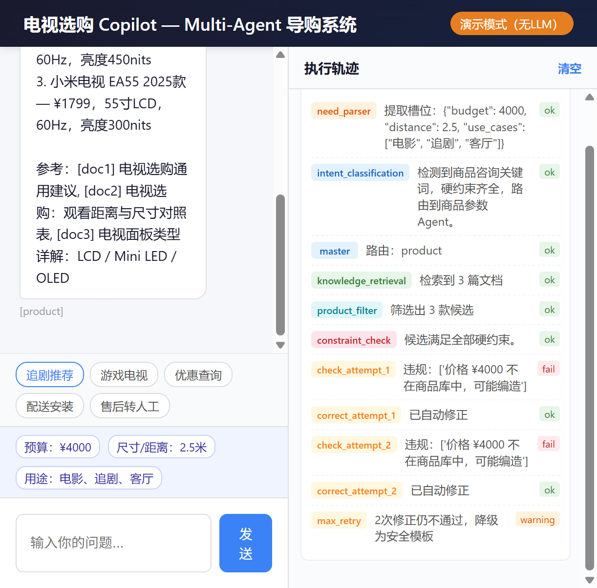
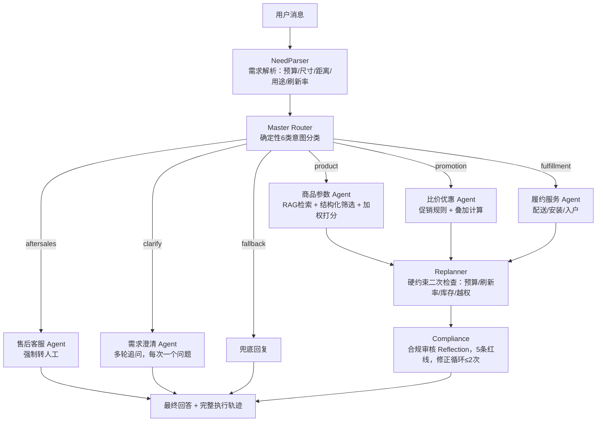

# 智能电视选购 Copilot — 纯 Python 自研 Multi-Agent 导购系统


**👉 [在线体验静态演示](https://alaraby527.github.io/tv-buying-copilot/)**

> 从零自研 Python 代码的 Multi-Agent 电视导购系统，零第三方依赖，clone 即跑。
>
> Master Router + 5 Worker + Replanner + Compliance 四层架构，25 条评测驱动迭代，通过率 V1.0 72% → V1.1 92%，幻觉从 4 次降到 0 次。



## 目录

- [业务背景](#业务背景)
- [用户场景](#用户场景)
- [人机方案](#人机方案)
- [架构设计](#架构设计)
- [评测与迭代](#评测与迭代)
- [成本优化](#成本优化)
- [演示方式](#演示方式)
- [技术栈](#技术栈)
- [快速开始](#快速开始)
- [项目结构](#项目结构)
- [数据边界](#数据边界)

## 业务背景

家电选购是高客单价、低频次、参数复杂的决策场景。用户在线上选购电视时，面对 Mini LED/OLED、分区数、峰值亮度、HDMI 2.1 等参数，往往需要在商品页、评测文章、客服之间反复切换。传统电商客服只能回答单轮问题，无法完成"需求理解→多品对比→优惠计算→履约确认"的连贯决策链。

本项目验证的核心问题：**Multi-Agent 架构能否把分散的商品、促销、履约、售后知识串成一条可追溯的导购链路，同时在参数引用上做到不幻觉、不编造？**

## 用户场景

- **目标用户**：正在线上选购电视的消费者，预算 3000-8000 元，对参数有疑问但不想自己做功课
- **核心场景**：用户用自然语言描述需求（预算、观看距离、用途），系统完成需求解析→多 Agent 协作→带引用来源的可解释推荐
- **边界**：不做实时价格查询、不做下单支付，价格和参数均标注"以商品详情页为准"

## 人机方案

| 环节 | AI 负责 | 人负责 |
|------|---------|--------|
| 需求理解 | 解析预算/尺寸/距离/用途，模糊时主动追问 | 提供真实需求 |
| 商品推荐 | RAG 检索知识库，结构化筛选打分 | 最终决策 |
| 优惠计算 | 拆解满减/会员券/以旧换新/国补叠加逻辑 | 以结算页为准 |
| 售后问题 | 保修政策等标准问题直接回答 | 退货/投诉等高风险场景**强制转人工** |

关键设计：售后 Agent 不做任何自主处理，退货、投诉、情绪激动一律转接人工客服。

## 架构设计



### 四层终止条件

| 类型 | 实现 |
|---|---|
| 完成 | Worker 成功 + 合规通过 |
| 失败 | 无候选且无降级 / 合规2次修正失败 |
| 中断 | 售后高风险 / 用户要求人工 |
| 防重复 | 澄清≤3次 / 合规修正≤2次 / 主循环≤8轮 |

### 核心模块

| 模块 | 文件 | 说明 |
|---|---|---|
| LLM 客户端 | `core/llm_client.py` | 3次指数退避重试，模型分级（强/弱模型） |
| 记忆系统 | `core/memory.py` | 短期记忆（会话槽位）+ 长期记忆（用户授权后本地存储） |
| 需求解析 | `core/parser.py` | 支持中文数字/3k缩写/2米5口语/否定句/4K8K排除 |
| RAG 检索 | `core/rag.py` | 自研 token overlap 检索 + 结构化商品筛选打分 |
| 约束检查 | `core/replanner.py` | 预算/刷新率/库存/越权检查，无候选拒绝编造 |
| 合规审核 | `agents/compliance.py` | 5条红线 + 修正循环 |

## 评测与迭代

### 评测集

25 条测试用例，覆盖 5 类意图：商品咨询（8条）、价格优惠（4条）、安装履约（4条）、售后服务（3条）、兜底与多轮（6条）。

### V1.0 → V1.1 迭代对比

| 指标 | V1.0 | V1.1 | 变化 |
|------|------|------|------|
| 通过率（≥4分） | 72%（18/25） | 92%（23/25） | +20pp |
| 平均 Token/条 | 2479 | 2423 | -2.3% |
| 幻觉（编造知识库外型号） | 4 次 | 0 次 | 消除 |
| 售后未转人工 | 1 次 | 0 次 | 修复 |

### V1.0 的失败案例与修复

| # | 问题 | 错误类型 | V1.0 现象 | V1.1 修复 |
|---|------|----------|----------|----------|
| 1 | 推荐知识库外型号 | 幻觉 | 推荐了小米S75、海信75E5N Pro、TCL 75Q9K等知识库未收录型号 | 约束 RAG 只返回知识库内商品，无候选时拒绝编造 |
| 2 | 技术对比引用不存在型号 | 幻觉 | Mini LED vs OLED 对比中引用海信E8N Ultra、索尼A95L | 对比原理时明确标注"知识库未收录OLED型号" |
| 6 | PS5推荐引用LG C3 | 幻觉 | 推荐了知识库外的LG C3 OLED | 只推荐知识库内的索尼75X90L和小米S Pro 75 |
| 7 | 量子点对比引用LG C4/索尼A80L | 幻觉 | 同上 | 同上 |
| 18 | "我要退货"未转人工 | 合规 | 反问订单号，未直接转接 | 售后 Agent 强制转人工，不做自主处理 |
| 20 | 回答末尾重复用户输入 | 格式 | "推荐个电视"重复出现 | 修正输出解析 |
| 25 | "那下单吧"直接教下单步骤 | 越权 | 生成了下单步骤，有引导错误风险 | 引导用户到电商平台搜索，不生成下单流程 |

V1.1 剩余 2 个未满分 Case：国补和以旧换新的回答偏通用，未能结合具体型号给出更精准的估算，留待后续迭代。

### RAG 检索策略

- **文档检索**：中文二元 gram + 拉丁词元的 token overlap 评分，返回 Top-3，避免全量塞入上下文
- **商品筛选**：结构化硬约束（预算/尺寸/刷新率/库存）先过滤，再按用途匹配×3 + 尺寸匹配×2 + 价格贴近预算 + 亮度加权打分
- **分库检索**：每个 Agent 只加载自己需要的知识库子集，上下文互不干扰
- **扩展路径**：知识库扩大后可平滑升级为向量检索，检索接口不变

## 成本优化

- **模型分级**：简单分类用规则/弱模型，复杂推荐用强模型
- **结果缓存**：promotion/fulfillment 高频查询缓存24小时
- **上下文压缩**：每个 Agent 只加载所需上下文，不全量塞入
- **确定性优先**：意图分类、商品筛选、约束检查全部规则实现，0 Token 成本

## 演示方式

### 方式一：在线静态演示（推荐）

**👉 [https://alaraby527.github.io/tv-buying-copilot/](https://alaraby527.github.io/tv-buying-copilot/)**

预填充3轮示例对话（商品推荐→优惠查询→售后转人工）和完整的 Agent 执行轨迹，无需安装即可体验界面和架构。

### 方式二：查看架构文档和评测报告

- `AI_PRD.md` — AI 产品需求文档
- `evaluation/eval-results-v1.0.md` — V1.0 评测结果
- `evaluation/eval-results-v1.1.md` — V1.1 评测结果
- `knowledge-base/` — 4 个知识库文档

### 方式四：运行自动化评测

```bash
python eval.py
```

## 技术栈

- **语言**：Python 3.10+（零第三方依赖，仅标准库）
- **前端**：原生 HTML/CSS/JS（单文件）
- **LLM**：OpenAI-compatible API（可选，无 Key 时降级确定性模板）
- **存储**：JSON 文件（知识库 + 长期记忆）

## 在线访问

请直接使用 README 顶部的 GitHub Pages 演示。仓库中的 `eval.py` 可用于评测脚本审阅，服务端源码仅作为实现材料保留。

## 项目结构

```
├── app.py                  # 编排引擎 + HTTP服务
├── eval.py                 # 自动化评测脚本
├── AI_PRD.md               # AI产品需求文档
├── docs/
│   └── index.html          # 静态演示页（GitHub Pages）
├── core/                   # 核心模块（LLM/记忆/解析/RAG/约束）
├── agents/                 # 7个Agent模块
├── data/                   # 知识库 + 评测集
├── evaluation/             # V1.0/V1.1评测结果
├── knowledge-base/         # 4个知识库文档
└── templates/index.html    # 前端界面
```

## 数据边界

- 知识库收录 4 款 75 寸电视（TCL 75Q10G Pro、海信75E8K、小米S Pro 75、索尼75X90L），非全量商品
- 价格、库存、促销信息均为知识库静态数据，不代表实时信息
- 所有参数回答均标注"以商品详情页为准"
- 长期记忆仅在用户授权后存储于本地

## License

MIT
